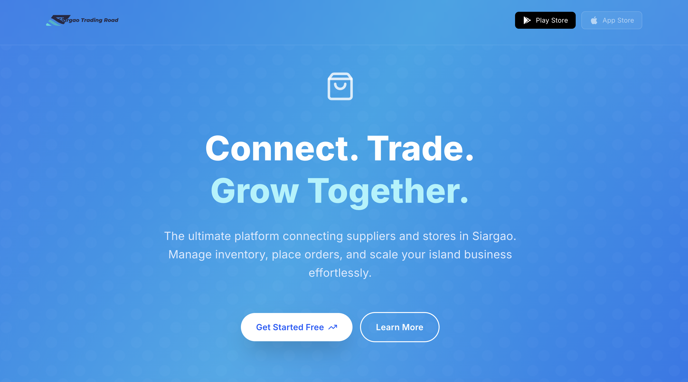
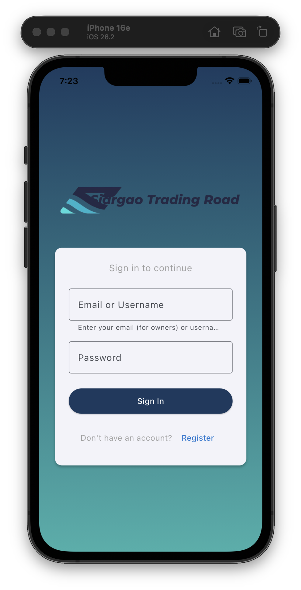
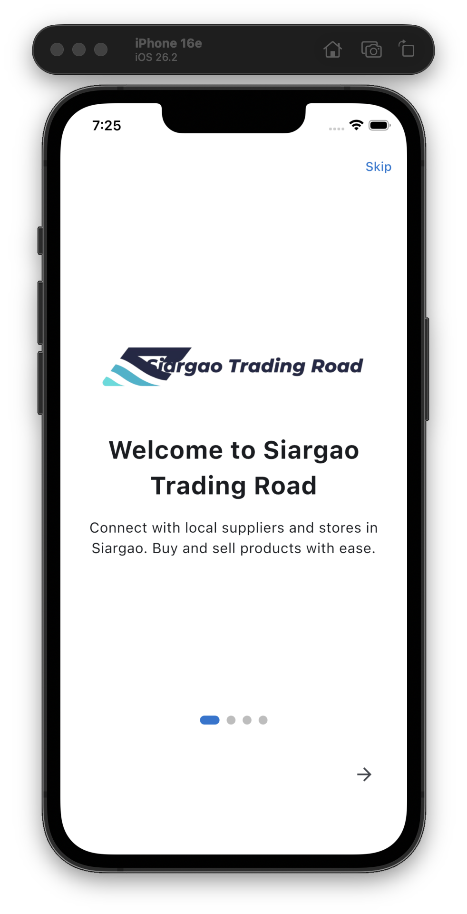
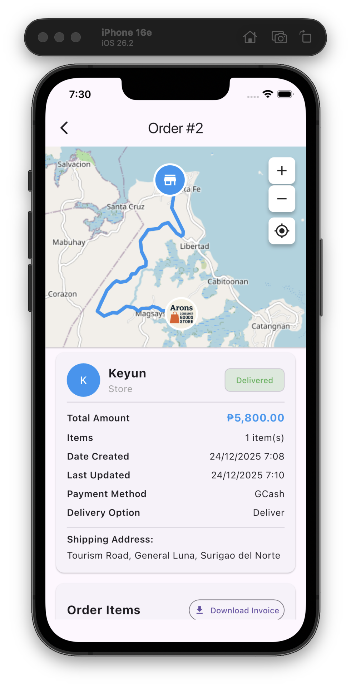
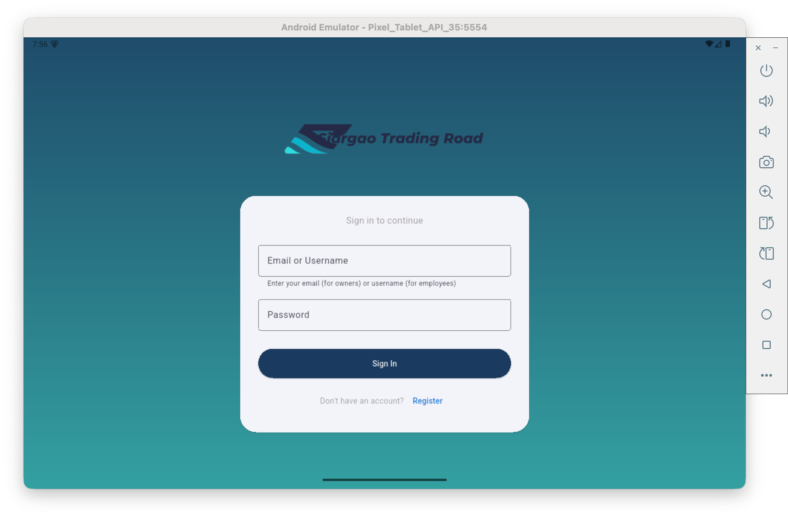
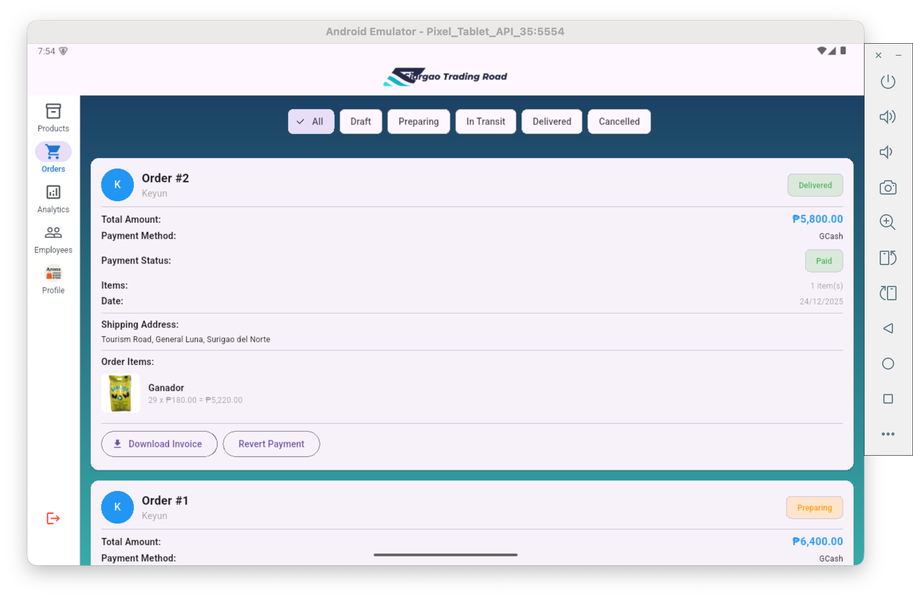

<div align="center"> 
	 
</div>

# Siargao Trading Road

Marketplace app connecting suppliers and stores in Siargao.

Siargao Trading Road is a comprehensive B2B marketplace platform designed to streamline the trading ecosystem in Siargao. The platform enables suppliers to manage their product catalogs, process orders, and track deliveries, while stores can browse supplier inventories, place orders, and manage their purchases. With features including real-time order tracking, route visualization, inventory management, and multi-platform support (web admin panel, React Native, and Flutter mobile apps), the platform provides a seamless trading experience for all stakeholders. The system includes role-based access control, secure authentication, order status management, messaging between parties, and comprehensive analytics dashboards for administrators.

<div align="center">


  <br/>


  <br/>


  <br/>

 
 
 


</div>

---

## Visual Overview

<div align="center">
  <h3>Landing Page</h3>
  
  
  <h3>iPhone</h3>
  
  
  
  
  <h3>Android Tablet</h3>
  
  
</div>

---

## Features

- **Supplier Management**: Register, add products via CSV/Excel bulk upload or manual entry
- **Store Management**: Register, browse suppliers, purchase products
- **Product Management**: Full CRUD operations with soft delete and restore
- **Bulk Product Upload**: Upload multiple products at once via CSV or Excel files with validation
- **Employee Management**: Create and manage employees with granular permissions
- **Order Management**: Complete order lifecycle from draft to delivery
- **Authentication**: JWT-based secure authentication system with employee login support
- **Multi-Platform**: 
  - Flutter mobile app (suppliers & stores)
  - Next.js web admin panel (admin only)

## Quick Start

### Backend (Golang API)

```bash
cd golang
go run main.go
```

Server runs on port **3020**. See [golang/README.md](./golang/README.md) for details.

### Frontend (Next.js Admin Panel)

**Prerequisites:**
- Node.js 18+
- Backend API running on `http://localhost:3020`

**Setup and Run:**
```bash
cd nextjs
npm install
npm run dev
```

Admin panel runs on port **3021** at `http://localhost:3021`.

**Default Admin Credentials:**
- Email: `admin@example.com`
- Password: `admin123`

For detailed setup, environment variables, and more information, see [nextjs/README.md](./nextjs/README.md).

### Mobile App (Flutter)

**Prerequisites:**
- Flutter SDK 3.0+
- Dart SDK 3.0+
- Backend API running on `http://192.168.31.76:3020` (or configure in `lib/services/api_service.dart`)
- Google Maps API key (for maps functionality)

**Setup and Run:**
```bash
cd flutter
flutter pub get
flutter run
```

For detailed setup, architecture, and features, see [flutter/README.md](./flutter/README.md).

## User Types

- **Supplier**: Register, add items via CSV/Excel bulk upload or manual entry, manage products and orders
- **Store**: Register, select supplier, buy products, manage orders
- **Employee**: Login with owner credentials, manage inventory and orders based on assigned permissions
- **Admin**: Manage users, products, orders via web panel, create and manage employees

## Storybook

This project uses [Storybook](https://storybook.js.org/) for component development and documentation.

### Next.js Storybook (Web Components)

View and test web components built with Material-UI:

```bash
cd nextjs
npm run storybook
```

Access at `http://localhost:2022`

<div align="center">
  
</div>

**Available Stories:**
- Buttons (variants, sizes, states, with icons)
- Headers (Admin, Store, Supplier, Landing page)
- Logo (different sizes and backgrounds)
- Tables (Products, Orders, Dashboard)
- Navigation (Admin, Store, Supplier drawers)

## Documentation

### Setup & Development
- [Backend API](./golang/README.md) - Golang API setup and testing
- [Admin Panel](./nextjs/README.md) - Next.js admin panel setup
- [Flutter Mobile App](./flutter/README.md) - Flutter mobile app setup and architecture

### Architecture & Infrastructure
- [Tech Stack](./docs/TECH_STACK.md) - Technology stack details
- [Database Schema](./docs/DATABASE_SCHEMA.md) - Database structure and relationships
- [EC2 Setup](./docs/EC2_SETUP.md) - Server setup instructions

### Business & Development Guides
- [Business E2E Flow](./docs/BUSINESS_E2E_FLOW.md) - End-to-end business process flows
- [Development Commands](./docs/COMMANDS.md) - Common development commands and shortcuts
- [Development API Testing](./docs/DEVELOPMENT_API_TEST.md) - API testing guide
- [Database Migration](./docs/DEVELOPMENT_DB_MIGRATION.md) - Database migration procedures
