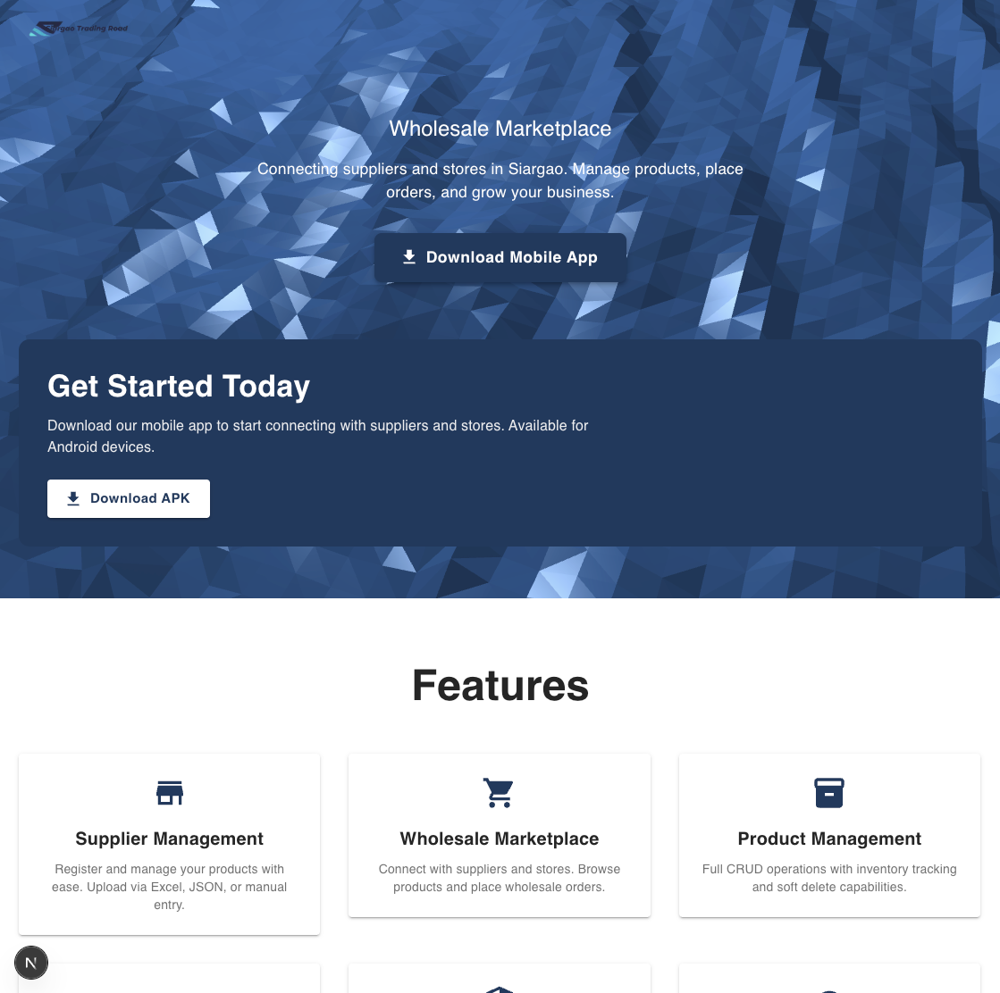
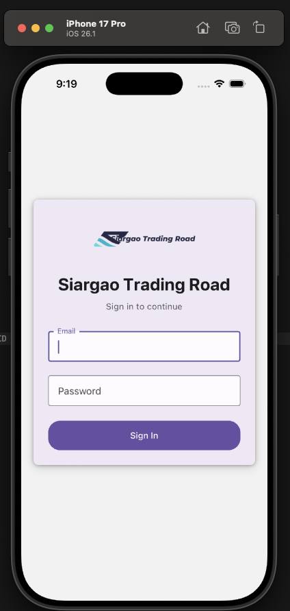
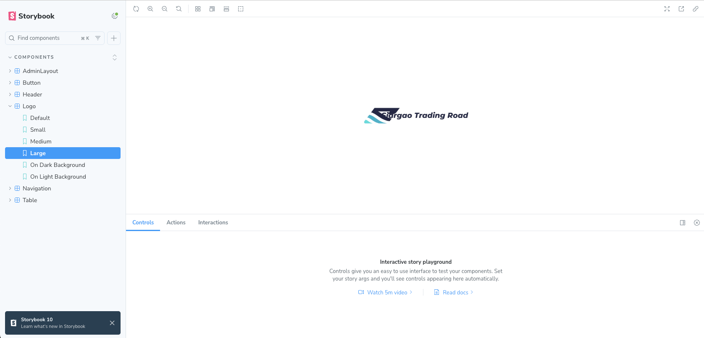

<div align="center"> 
	 
</div>

# Siargao Trading Road

Siargao Trading Road marketplace app connecting suppliers and stores in Siargao.

<div align="center">


   

</div>

---

## Visual Overview

<div align="center">
  <h3>Landing Page</h3>
  
  
  <h3>Mobile App - Login Screen</h3>
  
</div>

---

## Features

- **Supplier Management**: Register, add products via Excel/JSON/manual entry
- **Store Management**: Register, browse suppliers, purchase products
- **Product Management**: Full CRUD operations with soft delete and restore
- **Authentication**: JWT-based secure authentication system
- **Multi-Platform**: 
  - React Native mobile app (suppliers & stores)
  - Flutter mobile app (suppliers & stores) - *New*
  - Next.js web admin panel (admin only)

## Quick Start

### Backend (Golang API)

```bash
cd golang
go run main.go
```

Server runs on port **3020**. See [golang/README.md](./golang/README.md) for details.

### Frontend (Next.js Admin Panel)

**Prerequisites:**
- Node.js 18+
- Backend API running on `http://localhost:3020`

**Setup and Run:**
```bash
cd nextjs
npm install
npm run dev
```

Admin panel runs on port **3021** at `http://localhost:3021`.

**Default Admin Credentials:**
- Email: `admin@example.com`
- Password: `admin123`

**Storybook (Component Development):**
```bash
cd nextjs
npm run storybook
```

Storybook runs on port **2022** at `http://localhost:2022`.

For detailed setup, environment variables, and more information, see [nextjs/README.md](./nextjs/README.md).

### Mobile App (React Native)

**Prerequisites:**
- Node.js 18+
- Expo CLI (installed globally or via npx)
- Backend API running on `http://localhost:3020`
- iOS Simulator (for macOS) or Android Emulator / physical device

**Setup and Run:**
```bash
cd reactnative
npm install
npm start
```

For Android, use `npx expo run:android`. These commands build and run a development build on the simulator/emulator.

Alternatively, you can use `npm start` or `npx expo start` to launch the Expo dev server, then press `i` for iOS or `a` for Android, or scan the QR code with Expo Go app on your physical device.

For detailed setup, environment variables, building, and deployment, see [reactnative/README.md](./reactnative/README.md).

### Mobile App (Flutter)

**Prerequisites:**
- Flutter SDK 3.0+
- Dart SDK 3.0+
- Backend API running on `http://192.168.31.76:3020` (or configure in `lib/services/api_service.dart`)
- Google Maps API key (for maps functionality)

**Setup and Run:**
```bash
cd flutter
flutter pub get
flutter run
```

The Flutter app provides the same functionality as the React Native app, with a native Flutter implementation. Features include:
- Authentication (Login/Register)
- Role-based navigation (Supplier, Store, Admin)
- Product management with CRUD operations
- Order management with status tracking
- Maps integration with route visualization
- Cart functionality
- Profile management

For detailed setup, architecture, and features, see [flutter/README.md](./flutter/README.md).

### Mobile App Release

**Prerequisites:**
- EAS CLI installed: `npm install -g eas-cli`
- AWS CLI installed and configured
- Expo account and EAS project initialized
- Android credentials set up (one-time setup)

**Quick Release:**
```bash
cd reactnative
npm run release -- --platform android --profile preview
```

**Options:**
- `--platform`: `android`, `ios`, or `all` (default: `all`)
- `--profile`: `development`, `preview`, or `production` (default: `preview`)
- `--environment`: `development`, `staging`, or `production` (default: `development`)

The release script will:
1. Build the app using EAS Build
2. Download the build artifact
3. Upload to S3 (versioned and latest)
4. Provide download URLs

Builds are automatically uploaded to:
- **Versioned**: `{platform}/siargao-trading-road-{version}-{commit}-{timestamp}.{ext}`
- **Latest**: `{platform}/latest.{ext}` (used by landing page)

For detailed release instructions, troubleshooting, and setup, see [docs/RELEASE.md](./docs/RELEASE.md).

## Project Structure

```
siargaotradingroad/
├── reactnative/    # React Native mobile app
├── flutter/         # Flutter mobile app (Dart)
├── golang/          # Golang REST API
├── nextjs/          # Next.js admin panel
│   └── .storybook/  # Storybook configuration
├── postman/         # Postman API collection
├── infrastructure/  # Infrastructure as Code
└── docs/            # Documentation
```

## User Types

- **Supplier**: Register, add items (Excel/JSON/manual)
- **Store**: Register, select supplier, buy products
- **Admin**: Manage users, products, orders via web panel

## Storybook

This project uses [Storybook](https://storybook.js.org/) for component development and documentation.

### Next.js Storybook (Web Components)

View and test web components built with Material-UI:

```bash
cd nextjs
npm run storybook
```

Access at `http://localhost:2022`

<div align="center">
  
</div>

**Available Stories:**
- Buttons (variants, sizes, states, with icons)
- Headers (Admin, Store, Supplier, Landing page)
- Logo (different sizes and backgrounds)
- Tables (Products, Orders, Dashboard)
- Navigation (Admin, Store, Supplier drawers)

## Documentation

- [Backend API](./golang/README.md) - Golang API setup and testing
- [Admin Panel](./nextjs/README.md) - Next.js admin panel setup
- [React Native Mobile App](./reactnative/README.md) - React Native mobile app setup and deployment
- [Flutter Mobile App](./flutter/README.md) - Flutter mobile app setup and architecture
- [Mobile App Release](./docs/RELEASE.md) - Build and release mobile app to S3
- [Tech Stack](./docs/TECH_STACK.md) - Technology stack details
- [Database Schema](./docs/DATABASE_SCHEMA.md) - Database structure and relationships
- [EC2 Setup](./docs/EC2_SETUP.md) - Server setup instructions
